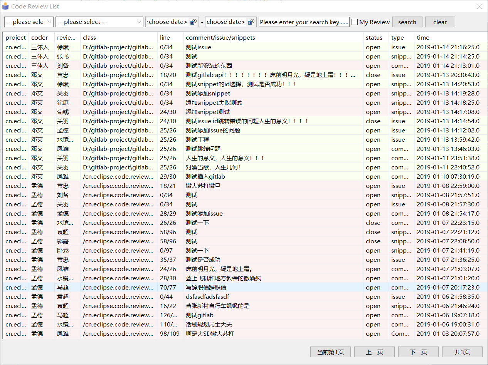
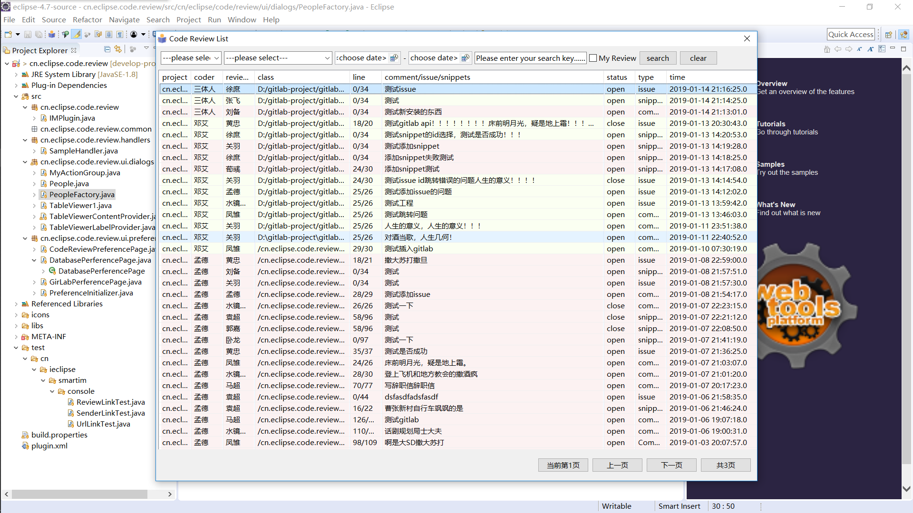
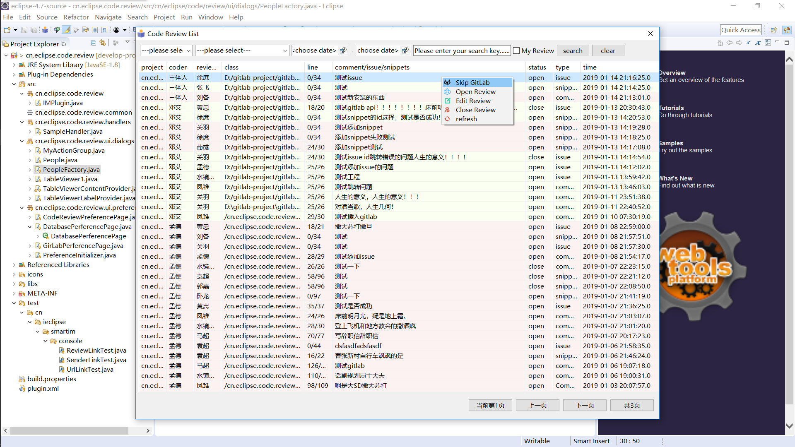
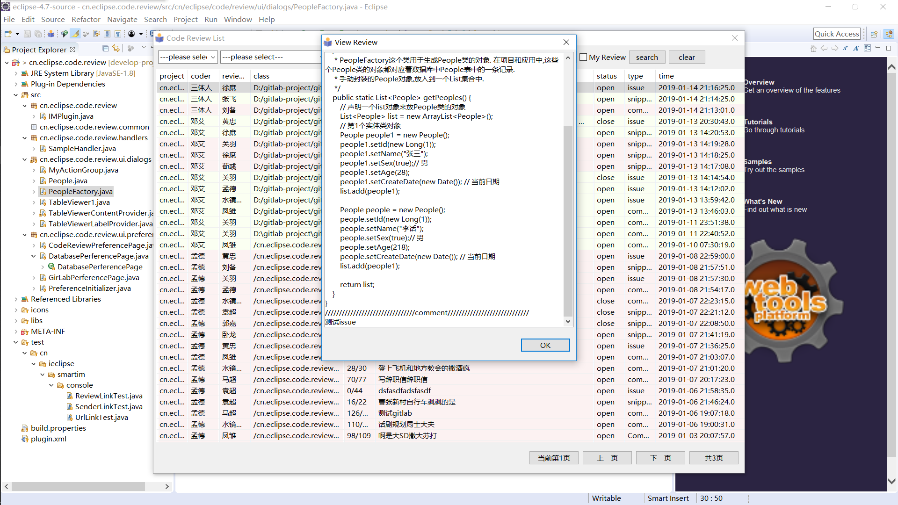
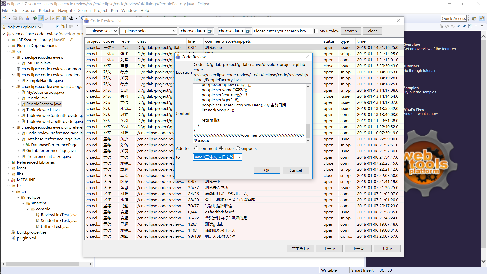
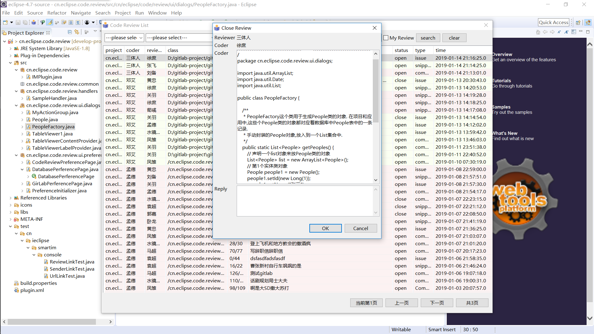
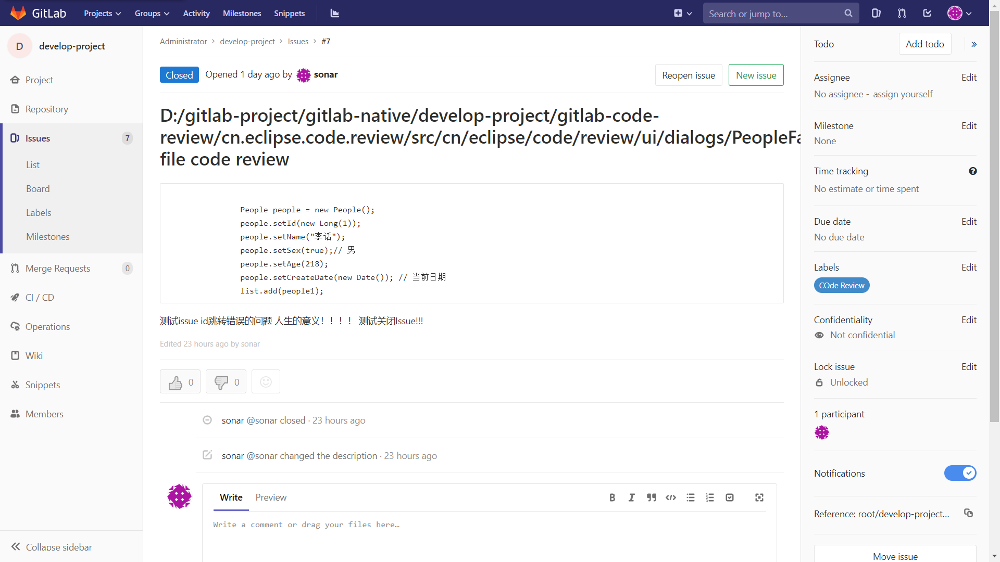
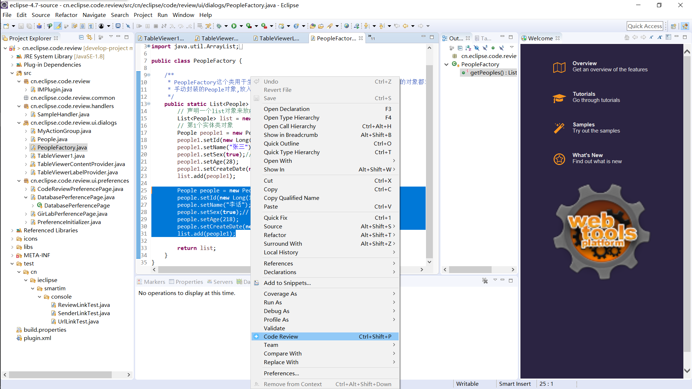
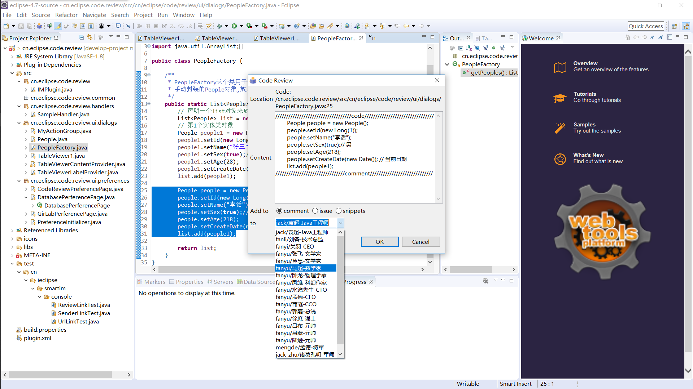
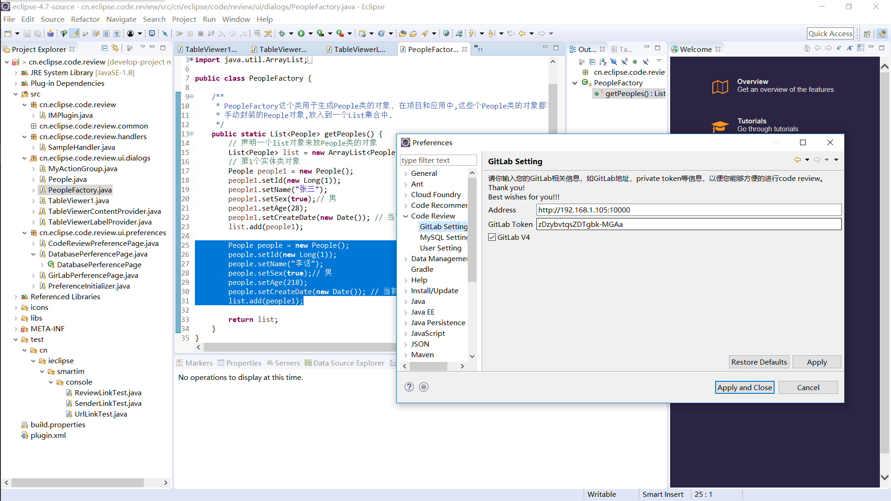

     
    
# code-review-gitlab
 This is the code review plug-in for eclipse associated gitlab！

## view

       

         

        

           

         

           

         

       

          

  

## Feature：
1、Add the commit comment to gitlab, but now no support to update;           
2、Add or Update the issue to gitlab;            
3、Add or Update a public snippet to gitlab.             
